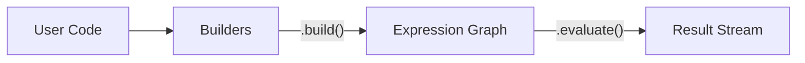

---
jupytext:
  text_representation:
    extension: .md
    format_name: myst
    format_version: 0.13
    jupytext_version: 1.16.4
kernelspec:
  display_name: Python 3
  language: python
  name: python3
---

# Architecture Overview

The Entity Query Language (EQL) is built on a clear separation between query definition and execution. This architectural pattern allows for complex query manipulation, optimization, and deferred evaluation.

## The Three Stages of a Query

Every EQL query passes through three distinct lifecycle stages:

1.  **Builder (Blueprint)**: The user interacts with {py:class}`~krrood.entity_query_language.query.builders.ExpressionBuilder`s to define the query's structure (where, having, grouped_by, etc.).
2.  **Expression (Execution Graph)**: When `.build()` is called, the builders materialize into {py:class}`~krrood.entity_query_language.core.base_expressions.SymbolicExpression` nodes, forming an execution graph.
3.  **Execution (Evaluation)**: The graph is traversed using {py:meth}`~krrood.entity_query_language.core.base_expressions.SymbolicExpression.evaluate`, which yields results as a stream of bindings.

## Builders vs. Expressions

| Stage | Class | Responsibility |
| :--- | :--- | :--- |
| **Builder** | `WhereBuilder`, `GroupedByBuilder` | Collects metadata, validates structure, and stores constraints. |
| **Expression** | `AND`, `Comparator`, `Query` | Implements the actual evaluation logic (`_evaluate__`). |

💡 **Hint**: The separation allows EQL to validate the query structure (e.g., checking if aggregators are used correctly in `having`) *before* the expensive evaluation process begins.

## The Query Lifecycle

1.  **Definition**: You call `entity(v).where(...)`. This populates the internal builders of the `Query` object.
2.  **Building**: When you call a result processor or quantifier (like `an()`), the query's `.build()` method is triggered. It converts all builders into their corresponding expression nodes.
3.  **Evaluation**: The root expression (usually a `ResultQuantifier` or `Query`) calls `_evaluate_()` on its children, starting the recursive evaluation process.

📝 **Note**: The `@modifies_query_structure` decorator ensures that once a query has been built into an execution graph, its structure cannot be modified further.

⚠️ **Warning**: Directly manipulating expression nodes is discouraged for end-users. Always use the `factories` and `Query` methods to build your queries.

## Simplified Visualization of the Pipeline

## API Reference
- {py:class}`~krrood.entity_query_language.query.builders.ExpressionBuilder`
- {py:class}`~krrood.entity_query_language.core.base_expressions.SymbolicExpression`
- {py:class}`~krrood.entity_query_language.query.query.Query`
